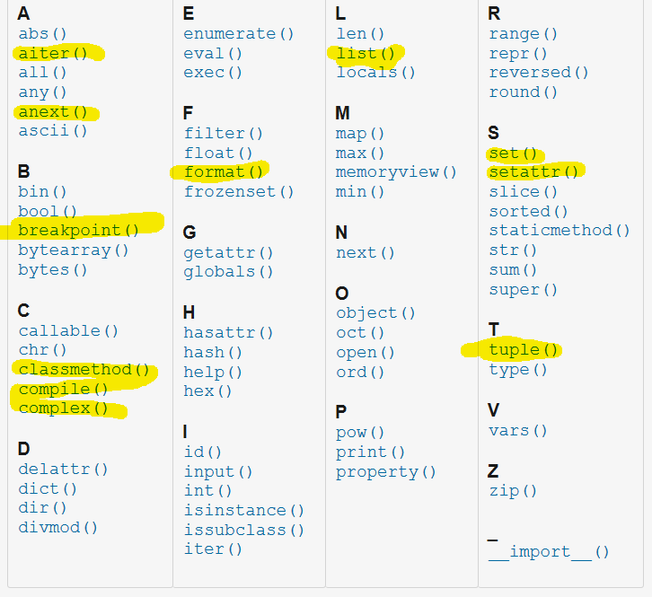

# Contributing
We love **[your input (Click Here)](https://github.com/ericsia/vscode-python-snippet-pack-2.0/issues)** whether it's:

- Reporting a typo
- Providing suggestion
- Submitting a fix or help, note: naming `prefix` needs to be meaningful and no multiple

**Great Bug Reports** tend to have:

- A quick summary and/or background
- Steps to reproduce
  - Be specific!
  - Give sample code if you can. 
- What you expected would happen
- What actually happens
- Notes (possibly including why you think this might be happening, or stuff you tried that didn't work)

## Need Help
Need help for example of the highlighed in picture below, if you have time please help to add them.
Please avoid taking from python official documentation directly, search for clearer example from google

## Here is [a tool](https://github.com/ericsia/jsonSnippet/raw/main/Eric's%20Snippet%20Generator.7z) if you want to help 
Adding new method/function and example can make it more complete and help everyone!
Note: please avoid spaces and use \t for the snippet

## We Use [Github Flow](https://guides.github.com/introduction/flow/index.html), update happened through Pull Requests
Pull requests are the best way to propose changes to the codebase. We actively welcome your pull requests:

1. Fork the repo and create your branch from `master`.
2. If you've added code that should be tested.
3. Issue that pull request when you are truly done!

## Any contributions you make will be under the MIT Software License
In short, when you submit code changes, your submissions are understood to be under the same [MIT License](http://choosealicense.com/licenses/mit/) that covers the project. 

## License
By contributing, you agree that your contributions will be [licensed](./LICENSE) under its MIT License.

