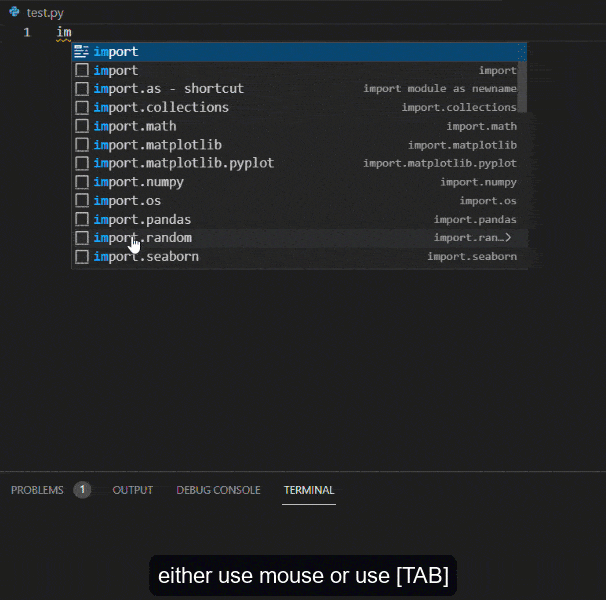

### Python Snippets Pack 3 (2022) for Visual Studio Code (python 3.x)
[](https://github.com/ericsia/vscode-python-snippet-pack-2.0/issues)
#### A beginner friendly python code snippet pack making you more productive
#### Please rate this extensions 5 stars and share it, feedback is welcome
#### Tips: uninstall similar snippet extension first. Reopen
*  added with new [python](https://docs.python.org/3/library/stdtypes.html) function, update legacy code
*  fixes a few unintended typo left by previous developer
*  use `TAB` to rename field in every method / feature
*  added label to method belong to string/list/tuple/set/dict
*  added python `<datatype>` and snippet, try typing `str`
*  added `match` snippet - python 3.10
*  added `np.init` snippet for numpy array [pip3 install numpy]
*  added `import` snippet
*  added `documentation`, `timeit` snippet
*  added `random` snippet
*  added `for`-loop snippet
*  added matplotlib template `plt`
*  added `dp` decimal place, `end`, `env`, `benchmark`, `self`, `sleep`, `swap` snippet
*  new format for easier selection, to see built in example type `apply.` `random.` `class` 
*  get example use `<datatype>.` while for available method use `.<datatype>` ex: `.string`
*  welcome to contribute to add more ideas, make it as complete as possible

#### Extra
*  checkout my [site](https://www.medlexo.ml/)



#### This snippet pack contains all below python method
*  all python built-in snippets and contains at least one example `=>` for each method
*  all python string snippets contains at least one example for each method
*  all python list snippets contains at least one example for each method
*  all python sets snippets contains at least one example for each method
*  all python tuple snippets contains at least one example for each method
*  all python dictionary snippets contains at least one example for each method
*  And contains a lot of other code snippets (like if:else, for, while, while:else, try:catch, fileIO and
*  class snippets and class examples for oop(polymorphism,encapsulation,inheritance .i.g)

#### if you never see that method before, don't worry this extension contains a lot of code examples for each python method
#### This extensions not only provide snippets but also helpful for learning python programming language
#### You will learn all python method with a lot of code examples
#### For example if you want to use string replace method then only use `.replace` 
#### But if you dont know how to use replace method then type `string` use str.replace=>

#### old gif from (2018) pay tribute to previous developer


## Snippets / Descriptons

| built-in methods code snippets | Description                                                                                                                                                                                             |
|--------------------------------|---------------------------------------------------------------------------------------------------------------------------------------------------------------------------------------------------------|
| abs                            | Returns the absolute value of a number                                                                                                                                                                  |
| all                            | Returns True if all items in an iterable object are true                                                                                                                                                |
| any                            | Returns True if any item in an iterable object is true                                                                                                                                                  |
| ascii                          | Returns a readable version of an object. Replaces none-ascii characters with escape character                                                                                                           |
| bin                            | Returns the binary version of a number                                                                                                                                                                  |
| bool                           | Returns the boolean value of the specified object                                                                                                                                                       |
| bytearray                      | Returns an array of bytes                                                                                                                                                                               |
| bytes                          | Returns a bytes object                                                                                                                                                                                  |
| callable                       | Returns True if the specified object is callable, otherwise False                                                                                                                                       |
| chr                            | Returns a character from the specified Unicode code.                                                                                                                                                    |
| delattr                        | Deletes the specified attribute (property or method) from the specified object                                                                                                                          |
| dict                           | Returns a dictionary (Array)                                                                                                                                                                            |
| dir                            | Returns a list of the specified object's properties and methods                                                                                                                                         |
| divmod                         | Returns the quotient and the remainder when argument1 is divided by argument2                                                                                                                           |
| enumerate                      | Takes a collection (e.g. a tuple) and returns it as an enumerate object                                                                                                                                 |
| eval                           | Evaluates and executes an expression                                                                                                                                                                    |
| exec                           | Executes the specified code (or object)                                                                                                                                                                 |
| filter                         | Use a filter function to exclude items in an iterable object                                                                                                                                            |
| float                          | Returns a floating point number                                                                                                                                                                         |
| frozenset                      | Returns a frozenset object                                                                                                                                                                              |
| getattr                        | Returns the value of the specified attribute (property or method)                                                                                                                                       |
| globals                        | Returns the current global symbol table as a dictionary                                                                                                                                                 |
| hasattr                        | Returns True if the specified object has the specified attribute (property/method)                                                                                                                      |
| hash                           | Returns the hash value of a specified object                                                                                                                                                            |
| help                           | Executes the built-in help system                                                                                                                                                                       |
| hex                            | Converts a number into a hexadecimal value                                                                                                                                                              |
| int                            | Returns an integer number                                                                                                                                                                               |
| id                             | Returns the id of an object                                                                                                                                                                             |
| input                          | Allowing user input                                                                                                                                                                                     |
| isinstance                     | Returns True if a specified object is an instance of a specified object                                                                                                                                 |
| issubclass                     | Returns True if a specified class is a subclass of a specified object                                                                                                                                   |
| iter                           | Returns an iterator object                                                                                                                                                                              |
| len                            | Returns the length of an object                                                                                                                                                                         |
| locals                         | Returns an updated dictionary of the current local symbol table                                                                                                                                         |
| map                            | Returns the specified iterator with the specified function applied to each item                                                                                                                         |
| max                            | Returns the largest item in an iterable                                                                                                                                                                 |
| memoryview                     | Returns a memory view object                                                                                                                                                                            |
| min                            | Returns the smallest item in an iterable                                                                                                                                                                |
| next                           | Returns the next item in an iterable                                                                                                                                                                    |
| object                         | Returns a new object                                                                                                                                                                                    |
| oct                            | Converts a number into an octal                                                                                                                                                                         |
| open                           | Opens a file and returns a file object                                                                                                                                                                  |
| ord                            | Given a string of length one, return an integer representing the Unicode code point of the character when the argument is a unicode object, or the value of the byte when the argument is an 8-bit str. |
| pow                            | Return x to the power y                                                                                                                                                                                 |
| print                          | Prints to the standard output device                                                                                                                                                                    |
| property                       | Gets, sets, deletes a property                                                                                                                                                                          |
| range                          | Returns a sequence of numbers, starting from 0 and increments by 1 (by default)                                                                                                                         |
| repr                           | Returns a readable version of an object                                                                                                                                                                 |
| reversed                       | Returns a reversed iterator                                                                                                                                                                             |
| round                          | Rounds a numbers                                                                                                                                                                                        |
| slice                          | Returns a slice object                                                                                                                                                                                  |
| sorted                         | Returns a sorted list                                                                                                                                                                                   |
| staticmethod                   | Converts a method into a static method                                                                                                                                                                  |
| str                            | Returns a string object                                                                                                                                                                                 |
| sum                            | Sums the items of an iterator                                                                                                                                                                           |
| super                          | Return a proxy object that delegates method calls to a parent or sibling class of type.                                                                                                                 |
| type                           | Returns the type of an object                                                                                                                                                                           |
| unichr                         | Return the Unicode string of one character whose Unicode code is the integer i.                                                                                                                         |
| vars                           | Returns the __dict__ property of an object                                                                                                                                                              |
| zip                            | Returns an iterator, from two or more iterators                                                                                                                                                         |


| built-in methods code examples | Description                              |
|--------------------------------|------------------------------------------|
| apply.abs=>int                 | An example for using abs method          |
| apply.abs=>float               | An example for using abs method          |
| apply.abs=>complex             | An example for using abs method          |
| apply.all=>list_1              | An example for using all with list       |
| apply.all=>list_2              | An example for using all with list       |
| apply.all=>tuple               | An example for using all with tuple      |
| apply.all=>set                 | An example for using all with set        |
| apply.all=>dictionary          | An example for using all with dictionary |
| apply.any=>list_1              | An example for using all with list       |
| apply.ascii=>_list_1           | An example for using ascii               |
| apply.bin=>_1                  | An example for using ascii               |
| apply.bool=>_1                 | An example for using bool                |
| apply.bytearray=>_1            | An example for using bool                |
| apply.bytes=>_1                | An example for using bytes               |
| apply.callable=>_1             | An example for using callable            |
| apply.callable=>_2             | An example for using bytes               |
| apply.chr=>_1                  | An example for using bytes               |
| apply.compile=>_1              | An example for using compile             |
| apply.compile=>_1              | An example for using compile             |
| apply.complex=>_1              | An example for using complex             |
| apply.complex=>_2              | An example for using complex             |
| apply.delattr=>_1              | An example for using delattr             |
| apply.dict=>_1                 | An example for using dict                |
| apply.dir=>                    | An example for using dict                |
| apply.divmod=>_1               | An example for using divmod              |
| apply.enumerate=>_1            | An example for using enumerate           |
| apply.eval=>_1                 | An example for using eval                |
| apply.exec=>_1                 | An example for using exec                |
| apply.filter=>_1               | An example for using filter              |
| apply.float=>_1                | An example for using float               |
| apply.float=>_2                | An example for using float               |
| apply.format=>_1               | An example for using format              |
| apply.frozenset=>_1            | An example for using frozenset           |
| apply.frozenset=>_2            | An example for using frozenset           |
| apply.frozenset=>_3            | An example for using frozenset           |
| apply.globals=>_1              | An example for using globals             |
| apply.globals=>_2              | An example for using globals             |
| apply.hasattr=>                | An example for using hasattr             |
| apply.hex=>                    | An example for using hasattr             |
| apply.int=>_1                  | An example for using int                 |
| apply.int=>_2                  | An example for using int                 |
| apply.id=>                     | An example for using id                  |
| apply.input=>_1                | An example for using input               |
| apply.input=>_2                | An example for using input               |
| apply.isinstance=>_1           | An example for using isinstance          |
| apply.isinstance=>_2           | An example for using isinstance          |
| apply.isinstance=>_3           | An example for using isinstance          |
| apply.issubclass=>             | An example for using isinstance          |
| apply.iter=>                   | An example for using iter                |
| apply.len=>_1                  | An example for using len                 |
| apply.len=>_2                  | An example for using len                 |
| apply.list=>                   | An example for using list                |
| apply.locals=>_1               | An example for using locals              |
| apply.locals=>_2               | An example for using locals              |
| apply.map=>_1                  | An example for using map                 |
| apply.map=>_2                  | An example for using map                 |
| apply.max=>_1                  | An example for using max                 |
| apply.max=>_2                  | An example for using max                 |
| apply.max=>_3                  | An example for using max                 |
| apply.memoryview=>             | An example for using memoryview          |
| apply.min=>_1                  | An example for using min                 |
| apply.min=>_2                  | An example for using min                 |
| apply.min=>_3                  | An example for using min                 |
| apply.next=>_1                 | An example for using next                |
| apply.next=>_2                 | An example for using next                |
| apply.object=>                 | An example for using object              |
| apply.oct=>                    | An example for using oct                 |
| apply.open=>                   | An example for using open                |
| apply.ord=>                    | An example for using ord                 |
| apply.pow=>                    | An example for using pow                 |
| apply.print=>_1                | An example for using print               |
| apply.print=>_2                | An example for using print               |
| apply.print=>_3                | An example for using print               |
| apply.property=>               | An example for using property            |
| apply.range=>_1                | An example for using range               |
| apply.range=>_2                | An example for using range               |
| apply.range=>_3                | An example for using range               |
| apply.reversed=>               | An example for using reversed            |
| apply.round=>_1                | An example for using round               |
| apply.round=>_2                | An example for using round               |
| apply.set=>                    | An example for using set                 |
| apply.setattr=>                | An example for using setattr             |
| apply.slice=>_1                | An example for using slice               |
| apply.slice=>_2                | An example for using slice               |
| apply.slice=>_3                | An example for using slice               |
| apply.sorted=>_1               | An example for using sorted              |
| apply.sorted=>_2               | An example for using sorted              |
| apply.sorted=>_3               | An example for using sorted              |
| apply.str=>                    | An example for using str                 |
| apply.sum=>_1                  | An example for using sum                 |
| apply.sum=>_2                  | An example for using sum                 |
| apply.tuple=>                  | An example for using tuple               |
| apply.type=>                   | An example for using type                |
| apply.vars=>                   | An example for using vars                |
| apply.zip=>_1                  | An example for using zip                 |
| apply.zip=>_2                  | An example for using zip                 |


| string methods code snippets | Description                                                                                   |
|------------------------------|-----------------------------------------------------------------------------------------------|
| .capitalize                  | Converts the first character to upper case                                                    |
| .casefold                    | Converts string into lower case                                                               |
| .center                      | Returns a centered string                                                                     |
| .count                       | Returns the number of times a specified value occurs in a string                              |
| .encode                      | Returns an encoded version of the string                                                      |
| .endswith                    | Returns true if the string ends with the specified value                                      |
| .expandtabs                  | Sets the tab size of the string                                                               |
| .find                        | Searches the string for a specified value and returns the position of where it was found      |
| .format                      | Formats specified values in a string                                                          |
| .format_map                  | Formats specified values in a string                                                          |
| .index                       | Searches the string for a specified value and returns the position of where it was found      |
| .isalnum                     | Returns True if all characters in the string are alphanumeric                                 |
| .isalpha                     | Returns True if all characters in the string are in the alphabet                              |
| .isdecimal                   | Returns True if all characters in the string are decimals                                     |
| .isdigit                     | Returns True if all characters in the string are digits                                       |
| .isidentifier                | Returns True if the string is an identifier                                                   |
| .islower                     | Returns True if all characters in the string are lower case                                   |
| .isnumeric                   | Returns True if all characters in the string are numeric                                      |
| .isprintable                 | Returns True if all characters in the string are printable                                    |
| .isspace                     | Returns True if all characters in the string are whitespaces                                  |
| .istitle                     | Returns True if the string follows the rules of a title                                       |
| .isupper                     | Returns True if all characters in the string are upper case                                   |
| .join                        | Joins the elements of an iterable to the end of the string                                    |
| .ljust                       | Returns a left justified version of the string                                                |
| .lower                       | Converts a string into lower case                                                             |
| .lstrip                      | Returns a left trim version of the string                                                     |
| .maketrans                   | Returns a translation table to be used in translations                                        |
| .partition                   | Returns a tuple where the string is parted into three parts                                   |
| .replace                     | Returns a string where a specified value is replaced with a specified value                   |
| .rfind                       | Searches the string for a specified value and returns the last position of where it was found |
| .rindex                      | Searches the string for a specified value and returns the last position of where it was found |
| .rpartition                  | Returns a tuple where the string is parted into three parts                                   |
| .rsplit                      | Returns a right trim version of the string                                                    |
| .split                       | Splits the string at the specified separator, and returns a list                              |
| .splitlines                  | Splits the string at line breaks and returns a list                                           |
| .startswith                  | Returns true if the string starts with the specified value                                    |
| .swapcase                    | Swaps cases, lower case becomes upper case and vice versa                                     |
| .title                       | Converts the first character of each word to upper case                                       |
| .translate                   | Returns a translated string                                                                   |
| .upper                       | Converts a string into upper case                                                             |
| .zfill                       | Fills the string with a specified number of 0 values at the beginning                         |


| string methods code examples | Description                       |
|------------------------------|-----------------------------------|
| str.capitalize=>_1           | An example for using capitalize   |
| str.capitalize=>_2           | An example for using capitalize   |
| str.casefold=>               | An example for using casefold     |
| str.center=>_1               | An example for using center       |
| str.center=>_2               | An example for using center       |
| str.count=>_1                | An example for using count        |
| str.count=>_2                | An example for using count        |
| str.encode=>                 | An example for using encode       |
| str.endswith=>_1             | An example for using endswith     |
| str.endswith=>_2             | An example for using endswith     |
| str.expandtabs=>_1           | An example for using expandtabs   |
| str.expandtabs=>_2           | An example for using expandtabs   |
| str.find=>_1                 | An example for using find         |
| str.find=>_2                 | An example for using find         |
| str.find=>_3                 | An example for using find         |
| str.find=>_4                 | An example for using find         |
| str.format=>                 | An example for using format       |
| str.format_map=>             | An example for using format_map   |
| str.index=>_1                | An example for using index        |
| str.index=>_2                | An example for using index        |
| str.index=>_3                | An example for using index        |
| str.index=>_4                | An example for using index        |
| str.isalnum=>                | An example for using isalnum      |
| str.isalpha=>                | An example for using isalpha      |
| str.isdecimal=>              | An example for using isdecimal    |
| str.isdigit=>                | An example for using isdigit      |
| str.isidentifier=>           | An example for using isidentifier |
| str.islower=>                | An example for using islower      |
| str.isnumeric=>              | An example for using isnumeric    |
| str.isprintable=>            | An example for using isprintable  |
| str.isspace=>                | An example for using isspace      |
| str.istitle=>                | An example for using istitle      |
| str.isupper=>                | An example for using isupper      |
| str.join=>                   | An example for using join         |
| str.ljust=>                  | An example for using ljust        |
| str.lower=>                  | An example for using lower        |
| str.lstrip=>                 | An example for using lstrip       |
| str.maketrans=>              | An example for using maketrans    |
| str.partition=>              | An example for using partition    |
| str.replace=>                | An example for using replace      |
| str.rfind=>                  | An example for using rfind        |
| str.rindex=>                 | An example for using rindex       |
| str.rpartition=>             | An example for using rpartition   |
| str.rsplit=>                 | An example for using rsplit       |
| str.split=>                  | An example for using split        |
| str.splitlines=>             | An example for using splitlines   |
| str.startswith=>             | An example for using startswith   |
| str.swapcase=>               | An example for using swapcase     |
| str.title=>                  | An example for using title        |
| str.translate=>              | An example for using translate    |
| str.upper=>                  | An example for using upper        |
| str.zfill=>                  | An example for using zfill        |


| list methods code snippets | Description                                                                  |
|----------------------------|------------------------------------------------------------------------------|
| .append                    | Adds an element at the end of the list                                       |
| .clear                     | Removes all the elements from the list                                       |
| .copy                      | Returns a copy of the list                                                   |
| .count                     | Returns the number of elements with the specified value                      |
| .extend                    | Add the elements of a list (or any iterable), to the end of the current list |
| .index                     | Returns the index of the first element with the specified value              |
| .insert                    | Adds an element at the specified position                                    |
| .pop                       | Removes the element at the specified position                                |
| .remove                    | Removes the first item with the specified value                              |
| .reverse                   | Reverses the order of the list                                               |
| .sort                      | Sorts the list                                                               |


| list methods code examples | Description                             |
|----------------------------|-----------------------------------------|
| list.append=>              | An example for using append             |
| list.clear=>               | An example for using clear              |
| list.copy=>                | An example for using copy               |
| list.count=>               | An example for using count              |
| list.extend=>              | An example for using extend             |
| list.index=>               | An example for using index              |
| list.insert=>              | An example for using insert             |
| list.pop=>                 | An example for using pop                |
| list.remove=>              | An example for using remove             |
| list.reverse=>             | An example for using reverse            |
| list.sort=>                | An example for using sort               |
| list.comp=>_1              | An example for using list comprehension |
| list.comp=>_2              | An example for using list comprehension |
| list.comp=>_3              | An example for using list comprehension |
| list.comp=>_4              | An example for using list comprehension |
| list.comp=>_5              | An example for using list comprehension |
  

| sets methods code snippets   | Description                                                                    |
|------------------------------|--------------------------------------------------------------------------------|
| .add                         | Adds an element to the set                                                     |
| .clear                       | Removes all the elements from the set                                          |
| .copy                        | Returns a copy of the set                                                      |
| .difference                  | Returns a set containing the difference between two or more sets               |
| .difference_update           | Removes the items in this set that are also included in another, specified set |
| .discard                     | Remove the specified item                                                      |
| .intersection                | Returns a set, that is the intersection of two other sets                      |
| .intersection_update         | Removes the items in this set that are not present in other, specified set(s)  |
| .isdisjoint                  | Returns whether two sets have a intersection or not                            |
| .issubset                    | Returns whether another set contains this set or not                           |
| .issuperset                  | Returns whether this set contains another set or not                           |
| .pop                         | Removes the specified element                                                  |
| .remove                      | Removes the specified element                                                  |
| .symmetric_difference        | Returns a set with the symmetric differences of two sets                       |
| .symmetric_difference_update | inserts the symmetric differences from this set and another                    |
| .union                       | Return a set containing the union of sets                                      |
| .update                      | Update the set with the union of this set and others                           |


| sets methods code examples         | Description                                      |
|------------------------------------|--------------------------------------------------|
| sets.add=>                         | An example for using add                         |
| sets.clear=>                       | An example for using clear                       |
| sets.copy=>                        | An example for using copy                        |
| sets.difference=>_1                | An example for using difference                  |
| sets.difference=>_2                | An example for using difference                  |
| sets.difference_update=>           | An example for using difference_update           |
| sets.discard=>                     | An example for using discard                     |
| sets.intersection=>_1              | An example for using intersection                |
| sets.intersection=>_2              | An example for using intersection                |
| sets.intersection_update=>_1       | An example for using intersection_update         |
| sets.intersection_update=>_2       | An example for using intersection_update         |
| sets.isdisjoint=>_1                | An example for using isdisjoint                  |
| sets.isdisjoint=>_2                | An example for using isdisjoint                  |
| sets.sets.issubset=>_1             | An example for using issubset                    |
| sets.issubset=>_2                  | An example for using issubset                    |
| sets.issuperset=>_1                | An example for using issuperset                  |
| sets.issuperset=>_2                | An example for using issuperset                  |
| sets.pop=>                         | An example for using pop                         |
| sets.remove=>                      | An example for using remove                      |
| sets.symmetric_difference=>        | An example for using symmetric_difference        |
| sets.symmetric_difference_update=> | An example for using symmetric_difference_update |
| sets.union=>_1                     | An example for using union                       |
| sets.union=>_2                     | An example for using union                       |
| sets.update=>                      | An example for using update                      |


| dictionary methods code snippets | Description                                                                                                 |
|----------------------------------|-------------------------------------------------------------------------------------------------------------|
| .clear                           | Removes all the elements from the dictionary                                                                |
| .copy                            | Returns a copy of the dictionary                                                                            |
| .fromkeys                        | Returns a dictionary with the specified keys and values                                                     |
| .get                             | Returns the value of the specified key                                                                      |
| .items                           | Returns a list containing the a tuple for each key value pair                                               |
| .keys                            | Returns a list containing the dictionary's keys                                                             |
| .pop                             | Removes the element with the specified key                                                                  |
| .popitem                         | Removes the last inserted key-value pai                                                                     |
| .setdefault                      | Returns the value of the specified key. If the key does not exist: insert the key, with the specified value |
| .update                          | Updates the dictionary with the specified key-value pairs                                                   |
| .values                          | Returns a list of all the values in the dictionary                                                          |
 
 
| dictionary methods code examples | Description                     |
|----------------------------------|---------------------------------|
| dict.clear=>                     | An example for using clear      |
| dict.copy=>                      | An example for using copy       |
| dict.fromkeys=>                  | An example for using fromkeys   |
| dict.get=>                       | An example for using get        |
| dict.items=>                     | An example for using items      |
| dict.keys=>                      | An example for using keys       |
| dict.pop=>                       | An example for using pop        |
| dict.popitem=>                   | An example for using popitem    |
| dict.setdefault=>                | An example for using setdefault |
| dict.update=>                    | An example for using update     |
| dict.values=>                    | An example for using values     |


| tuple methods code snippets | Description                                                                             |
|-----------------------------|-----------------------------------------------------------------------------------------|
| .count                      | Returns the number of times a specified value occurs in a tuple                         |
| .index                      | Searches the tuple for a specified value and returns the position of where it was found |
 
 
| tuple methods code examples | Description                |
|-----------------------------|----------------------------|
| tuple.count=>               | An example for using count |
| tuple.index=>               | An example for using index |


| for loop code snippets | Description    |
|------------------------|----------------|
| for                    | for Statements |
 
 
| for loop code examples  |                          |
|-------------------------|--------------------------|
| for=>                   | An example for using for |
| for=>through_a_string   | An example for using for |
| for=>break_statement    | An example for using for |
| for=>continue_statement | An example for using for |
| for=>range_function_1   | An example for using for |
| for=>range_function_2   | An example for using for |
| for=>range_function_3   | An example for using for |
| for=>for_else           | An example for using for |
| for=>for_else           | An example for using for |


| while loop code snippets | Description      |
|--------------------------|------------------|
| while                    | while Statements |
| while_else               | while Statements |
  
  
| while loop code examples  | Description      |
|---------------------------|------------------|
| while=>                   | while Statements |
| while=>break_statement    | while Statements |
| while=>continue_statement | while Statements |


| if/else statement code snippets | Description                |
|---------------------------------|----------------------------|
| if                              | if Statements              |
| ifelif                          | if/else if Statements      |
| ifelifelse                      | if/else if/else Statements |
| ifelse                          | if/else Statements         |
| ifshort                         | ifshort Statements         |
| else                            | else Statements            |


| class code snippets | Description           |
|---------------------|-----------------------|
| class=>             | python class          |
| __init__=>          | class __init__ method |
| __iter__=>          | class __iter__ method |
| __next__=>          | class __next__ method |
  

| class code examples     | Description                  |
|-------------------------|------------------------------|
| class=>_1               | oop inheritance example      |
| class=>inheritance_1    | oop inheritance example      |
| class=>inheritance_2    | oop inheritance example      |
| class=>with_attribute_1 | class with attribute example |
| class=>with_attribute_2 | class with attribute example |
| class=>with_attribute_3 | class with attribute example |
| class=>with_method_1    | class with method example    |
| class=>with_method_2    | class with method example    |
| class=>encapsulation    | class encapsulation example  |
| class=>polymorphism     | class polymorphism example   |


| import code snippets | Description   |
|----------------------|---------------|
| import=>             | import module |


| List Comprehensions code snippets | Description         |
|-----------------------------------|---------------------|
| comp=>                            | List Comprehensions |


| List Comprehensions code examples | Description                             |
|-----------------------------------|-----------------------------------------|
| list.comp=>_1                     | An example for using list comprehension |
| list.comp=>_2                     | An example for using list comprehension |
| list.comp=>_3                     | An example for using list comprehension |
| list.comp=>_4                     | An example for using list comprehension |
| list.comp=>_5                     | An example for using list comprehension |


| lambda code examples | Description                                                                           |
|----------------------|---------------------------------------------------------------------------------------|
| lambda               | A lambda function can take any number of arguments, but can only have one expression. |


| function code snippets  | Description                            |
|-------------------------|----------------------------------------|
| def=>                   | Defining Function                      |
| def=>with_default_value | Defining Function wqith default values |
| function=>              | Defining Function                      |


| file code examples             | Description                            |
|--------------------------------|----------------------------------------|
| file=>openFile                 | open a file                            |
| file=>openFileReadLine         | Read one line of the file              |
| file=>writeExistFile           | Write to an Existing File              |
| file=>writeOwerWrite           | Open a file and overwrite the content  |
| file=>createFileIfDoesNotExist | Create a new file if it does not exist |
| file=>createFile               | Create a new file                      |
| file=>deleteFile               | delete a file                          |

### For example

Creating a class - thanks for snippsat mention f-string

class=>with_attribute_1

```
class Parrot:

# class attribute
    species = 'bird'

# instance attribute
    def __init__(self, name, age):
        self.name = name
        self.age = age

# instantiate the Parrot class
blu = Parrot('Blu', 10)
woo = Parrot('woo', 15)

# access the class attributes
print(f'Blu is a {blu.__class__.species}')
print(f'Woo is also a {woo.__class__.species}')
# access the instance attributes
print(f'{blu.name} is {blu.age} years old')
print(f'{woo.name} is {woo.age} years old')
```

  
  


## Release Notes

Users appreciate release notes as you update your extension.

### For more information

* [python documentation](https://docs.python.org/3/tutorial/index.html)
* [w3schools](https://www.w3schools.com/python/default.asp)
* [www.programiz](https://www.programiz.com/python-programming)
* [python.swaroopch](https://python.swaroopch.com/oop.html)
* [pythonforbeginners](https://www.pythonforbeginners.com/basics/list-comprehensions-in-python)


**Enjoy!**

### 1.0.0

Initial release of python code snippets

### 1.0.2

Updated README.md

### 2.0.2

Updated and maintain in year 2022

### 3.0.2

Change .format into f-string

### 3.0.6

Updated README.md and remove unecessary files from package

-----------------------------------------------------------------------------------------------------------
